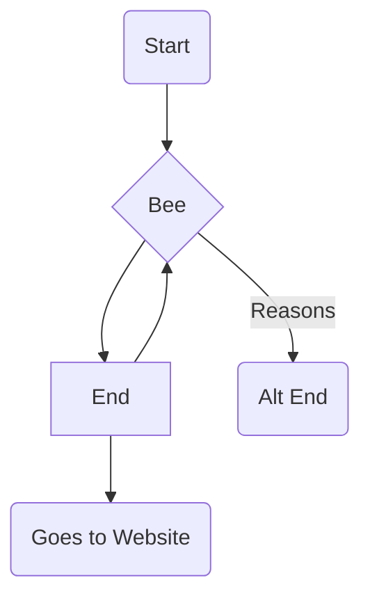

# Town Clock

## Overview



```mermaid
sequenceDiagram
    participant Client
    participant OAuth
    participant Server
    Client ->>+ OAuth: Request Access Token
    OAuth ->>- Client: Sends back token
    Client ->>+ Server: Requests resource
    Server ->>+ OAuth: Validates token
    OAuth ->>- Server: Token Valid
    Server ->>- Client: Sends resources

